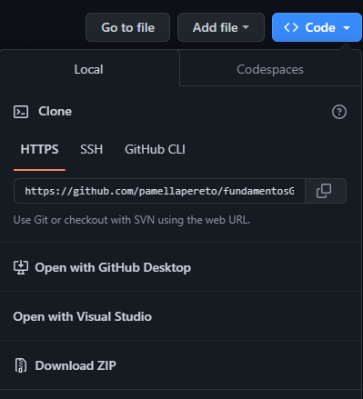

# Tutorial de Git e Github na prática

* [Link](http://git-scm.com/downloads)

## Versionamento local do projeto
* Acesse a pasta na qual o projeto está armazenado 
* Clique com o botão direto do mouse e selecione **Open Git Bash here**
* Digite `git init` para inicializar o repositório
  
  Será criada uma pasta chamada `.git`, **não** a apague
* Digite `git add .` para colocar os arquivos do projeto na **área de string**  
  
  * Digite `git commit - m "primeira versão do projeto"` para versionar **localmente** o projeto
  * Digite `git branch -M "main"` para renomear a branch principal `master` para `main` 

## Criação de um repositório remoto do Github
* Acesse a sua conta do Github e clique em `New` para criar um novo repositório

Coloque um nome para o repositório e preencha as informações do projeto, como a descrição
* Para enviar o commit do repositório local (isto é, em sua máquina) para um repositório na
plataforma da Github, digite por linha de comando `git remote add add origin <link do repositório>`

`origin` é o nome utilizado paa referenciar o link do repositório remoto

* Dessa forma, o repositório local já está vinculado ao repositório remoto do Github, entretanto, a versão (isto é, o commit) não sobe automaticamente, por isso é necesário digitar:
**`git push -u origin main`**
* Por fim, recarregue a página do Github e verifique se o projeto foi versionado **remotamente**

## E quando o projeto for alterado? 

* Ao editar um arquivo já versionado ou mesmo criar um novo arquivo que não existia na versão anterior, **NÃO** é necessário inicializar novamente o Git por meio do comando `git init`, sendo assim, execute **APENAS** os seguintes comandos em ordem:
    `git add .`

    `git status` para verificar os arquivos que estejam aguardando na staging area

    `git commit -m "<escreva uma mensagem detalhando o que foi alterado>`

    `git push`

    Como é possível notar, também **NÃO** é necessário renomear mais uma vez a branch (pois ela já estará renomeada como `main`), além disso, o link do repositório remoto já estará armazenado, por isso o comando `git remote add origin <link do repositório>` só é utilizando uma única vez

    * No Github será possível verificar todas as versões enviadas clicando em `commits`, de modo que todas alterações feitas estarão demonstradas

O sinal verde `+` representa o que foi adicionado/editado no versionamento, enquanto o sinal vermelha `-` representa o que foi excluído de uma versão para outra

## Branch 

* Até então, todos os versionamentos ocorreram na **ramificação principal (branch `main`)**
*Para criar uma nova branch, isto é, uma nova linha cronológica adicional/alternativa à principal que possa posteriormente se juntar à `main`, digite `git checkout -b <nome da nova branch>`, assim o Git sairá da branch `main`, criará uma nova com o nome que desejar e entrará nela, por exemplo: `git checkout -b novo-botao`
* Com uma nova branch criada, utilize os comandos já explicados:  
    `git add .`

    `git status`

    `git commit -m "<escreva uma mensagem>"`

    `git push ú origin novoBotao`

* No Github, as branches aparecerão assim:

* Se necessário retornar para branch `main` pelo terminal do Git, digite `git checkout main`

## Merge

* Ao retornar para a branch `main`, digite `git merge <nome da nova branch>` (no exemplo acima, seria a branch chamada novoBotao), desse modo será possível **unificar a branch alternativa e a branch principal em uma só**

* Assim, tudo o que tinha de alteração na branch novoBotao (por exemplo) se juntará à branch `main`

* Para finalizar digite `git push origin main` e suba os arquivos para a branch principal do repositório remoto

## Clone

* Para fazer o download de um repositporio remoto, seu ou de outro usuário, há duas opções:
* 1ª opção: clicar no botão `Code` que se encontra no próprio Github, conforme a imagem abaixo
 
  

* 2ª opção: utilizando o mesmo link presente na imagem acima, abra o terminal e digite `git clone <link copiado do repositório remoto>`
**Observação**: é importante que, ao clonar um repositório de sua própria conta no Github, verifique  qual branch está como `default`, pois o **projeto clonado será aquele que se encontra na branch `default`**

## Pull

* E se o desenvolvedor, ao digitar novos códigos em seu computador de casa e enviá-los para o reprositório remoto, perceber ao chegar no trabalho que o projeto na máquina do escritório está desatualizado?

* Para puxar **todas as alterações realizadas do repositório remoto (Github) para o seu repositório local**, digite `git pull`
* Testando na prática o git pull!
